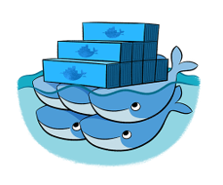

---

### Goals

* Primary Goal of this Session is to Raise Awareness
* Insight into Potential Benefits
* Intentionally Meant to Leave you with Questions      
* Hopefully Interested in a Deeper Dive by the End

---

### Introduction

* Who has heard of, read about or otherwise had some exposure to [Docker](http://docker.com)?
* Anyone tried any Docker demos/tutorials?
* Has anyone used Docker for development?
* Who uses Docker in production?

---

### Docker History

* Author: Solomon Hykes ([@solomonstre](https://twitter.com/solomonstre))
* Company: Docker, Inc (started as a dotCloud project)
* Initial Release: March 13, 2013
* License: Apache 2.0 license
* Github: 43k+ stars (https://github.com/docker) (https://github.com/moby/moby)
* Docker Hub repositories (hub.docker.com)
* Main Contributors: The Docker team, Cisco, Google, Huawei, IBM, Microsoft, and Red Hat

---

### What is Docker (v17.03.1-ce)

* Developers use Docker to eliminate "works on my machine" problems during collaboration. 
* DevOps use Docker to run and manage apps side-by-side in isolated containers to get better compute density.
* Enterprises use Docker to build agile software delivery pipelines to ship new features faster, more securely and with confidence for both Linux and Windows Server apps.

---

### Docker vs VMs


---

### Benefits of Docker

* Return on investment & cost savings
* Standardization & productivity
* Continuous Integration (CI) Efficiency
* Compatibility & Maintainability
* Rapid Deployment, Migrations, Restarts
* Continuous Deployment & Testing
* Isolation
* Security
* Version control capabilities 

---

### Common Uses of Docker

* Sandbox environment (develop, test, debug, POC, )
* Continuous Integration & Deployment
* Scaling apps
* Development collaboration
* Infrastructure configuration
* Local development
* Multi-tier applications

###### [Survey Results from 2016](https://www.docker.com/survey-2016)

---

### Technology behind Docker

* Linux [x86-64](https://www.wikiwand.com/en/X86-64)
* [Go](https://golang.org/) language
* [Client - Server](https://www.wikiwand.com/en/Client%E2%80%93server_model) (deamon) architecture
* Union file systems ([UnionFS](https://www.wikiwand.com/en/UnionFS): AUFS, btrfs, vfs etc)
* [Namespaces](https://en.wikipedia.org/wiki/Cgroups#NAMESPACE-ISOLATION) (pid, net, ipc, mnt, uts)
* Control Groups ([cgroups](https://www.wikiwand.com/en/Cgroups))
* Container format ([libcontainer](https://github.com/opencontainers/runc/tree/master/libcontainer))

###### Additional Reading [Docker Docs](https://docs.docker.com/engine/docker-overview/)

---

### The Docker architecture


###### Additional Reading [Docker Docs](https://docs.docker.com/engine/docker-overview/)

---

### Docker components

* Docker Engine
* Docker Daemon
* Docker Client
* Docker Registries
* Docker Objects (images, containers, networks, ....)
 

---

### Docker Engine
A lightweight and powerful open source containerization technology combined with a work flow for building and containerizing your applications.
Usually referred simply as "docker".

---

### Docker Daemon
The Docker daemon (dockerd) listens for Docker API requests and manages Docker objects such as images, containers, 
networks, and volumes. A daemon can also communicate with other daemons to manage Docker services.

---

### Docker Client
* The Docker client (docker) is the primary way that many Docker users interact with Docker. 
* When you using commands such as docker run, the client sends these commands to dockerd, which carries them out. 
* requirements
 - Virtualization must be enabled. 
 - Docker for Windows runs on 64bit Windows 10 Pro, Enterprise and Education w/ plans to support more versions of Windows 10.

---

### Docker Machine


Machine was the only way to run Docker on Mac or Windows previous to Docker v1.12. Starting with the beta program and Docker v1.12, Docker for Mac and Docker for Windows are available as native apps and the better choice.

---

### Docker Registry
A Docker registry stores Docker images. Docker Hub and Docker Cloud are public registries that anyone can use, and Docker is configured to look for images on Docker Hub by default. You can even run your own private registry. 

---

### Docker compose


A tool for defining and running complex applications with Docker (eg a multi-container application) with a single file.

---

### Docker swarm


Docker Engine 1.12 includes swarm mode for natively managing a cluster of Docker Engines called a swarm. Use the Docker CLI to create a swarm, deploy application services to a swarm, and manage swarm behavior.

---

### Docker distribution


A (hosted) service containing repositories of images which responds to the Registry API.

---

### Steps of a Docker workflow

```
docker run -it --rm ubuntu:15.04 /bin/bash
```

* Pulls the ubuntu:15.04 [image](https://docs.docker.com/engine/userguide/containers/dockerimages/ "A read-only layer that is the base of your container. It can have a parent image to abstract away the more basic filesystem snapshot.") from the [registry](https://docs.docker.com/registry/ "The central place where all publicly published images live. You can search it, upload your images there and when you pull a docker image, it comes the repository/hub.")
* Creates a new [container](https://docs.docker.com/engine/userguide/storagedriver/imagesandcontainers/ "A runnable instance of the image, basically it is a process isolated by docker that runs on top of the filesystem that an image provides.")
* Allocates a filesystem and mounts a read-write [layer](https://docs.docker.com/engine/reference/glossary/#filesystem "A set of read-only files to provision the system. Think of a layer as a read only snapshot of the filesystem.")
* Allocates a [network/bridge interface](https://www.wikiwand.com/en/Bridging_%28networking%29 "")
* Sets up an [IP address](https://www.wikiwand.com/en/IP_address "An Internet Protocol address (IP address) is a numerical label assigned to each device (e.g., computer, printer) participating in a computer network that uses the Internet Protocol for communication.")
* Executes a process that you specify (``` /bin/bash ```)
* Captures and provides application output

```
docker image history ubuntu:15.04
```

---

### The docker image


---

### The docker container

.")

###### Understanding Docker [Images & Containers](https://docs.docker.com/engine/userguide/storagedriver/imagesandcontainers/)

---

### The Dockerfile

> A Dockerfile is a text document (think script) that contains all the commands a user could call on the command line to create an image.

* [Dockerfile reference](https://docs.docker.com/engine/reference/builder/) on docker docs
* Official Dockerfiles ([nodejs](https://hub.docker.com/_/node/), [java (openjdk)](https://hub.docker.com/_/openjdk/))

---

### Common Docker Commands

* [Docker Commandline Reference](https://docs.docker.com/engine/reference/commandline/docker/)
 - docker container
 - docker image
 - docker run

---

### Docker Best Practices

* Best practices for writing [Dockerfiles](https://docs.docker.com/engine/userguide/eng-image/dockerfile_best-practices/)
* Containers should be ephemeral
* Use a .dockerignore file
* Avoid installing unnecessary packages
* Each container should have only one concern
* Minimize the number of layers
* ....and more

---

### Getting Started with Docker

* [Docker Docs: Get Started](https://docs.docker.com/get-started/)
* [Play with Docker](http://labs.play-with-docker.com/) 
* [Training at Play w/ Docker](http://training.play-with-docker.com/)

---

### Docker Docs: Get started with Docker

* Part 1: Orientation
* Part 2: Containers
* Part 3: Services
* Part 4: Swarms
* Part 5: Stacks
* Part 6: Deploy your app

---

### Play with Docker 

 - Beginner
 - Intermediate
 - Advanced 

---

### Beginner

* Hello World 
* First Alpine Linux Container 
* Simple Web App 
* Swarm stack introduction 
* Docker images deeper dive 
* Docker containers deeper dive 
* Docker Volumes 
* Swarm mode introduction 
* Docker compose with swarm secrets 
* Windows Containers Setup 
* Windows Containers Basics 
* Windows Containers Multi-Container Applications 

---

### Intermediate

* Reducing nodejs Docker images size by %50 
* Service Discovery under Docker Swarm Mode 
* Docker volume sshfs 
* Swarm synchronous services 
* WebApps with Traefik LoadBalancing 
* Multi-stage builds 
* Orchestration, part 1: from Compose to Swarm 
* Orchestration, part 2: securing and operating Swarm 
* Docker networking 
* Live Debugging Node.js with Docker 
* In-container Java Development: Netbeans 
* In-container Java Development: Intellij 
* In-container Java Development: Eclipse 

---

### Advanced

* LinuxKit 101: building the redis-os from DockerCon2017 
* Security Lab: Capabilities 
* Security Lab: Seccomp 

---

### Closing (See Goals)

* Primary Goal of this Session was to Raise Awareness
* Insight into Potential Benefits
* Intentionally Meant to Leave you with Questions       
* Hopefully Interested in a Deeper Dive by this point
